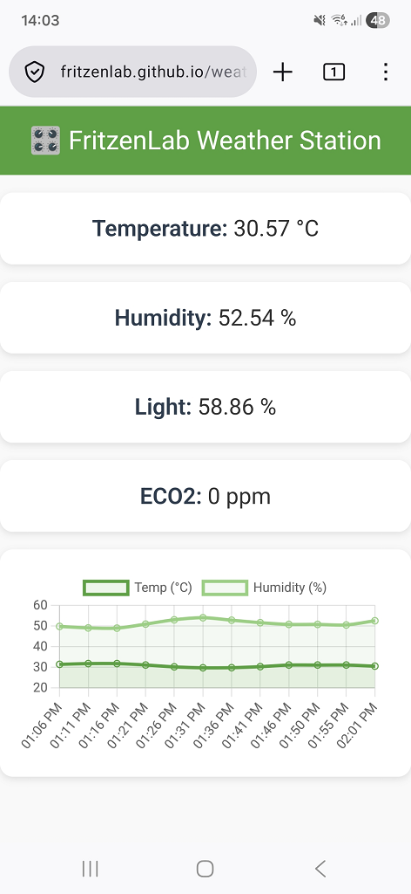

# 🌤 FritzenLab Weather Station

**Repository:** [https://github.com/FritzenLab/weather-station-fritzenlab-v2](https://github.com/FritzenLab/weather-station-fritzenlab-v2)

This project is an **ESP32‑based IoT weather station** that measures temperature, humidity, light intensity, and air quality (ECO₂, TVOC, AQI).  
It publishes data securely to **Adafruit IO via MQTT**, sends notifications through **Telegram** and **NTFY**, and supports **ElegantOTA** for remote firmware updates.

---

---
## 🧠 Overview

The station continuously collects environmental data using:
- **AHT21 sensor** for temperature and humidity  
- **DFRobot ENS160** for air quality (AQI, TVOC, ECO₂)  
- **LDR analog sensor** for light intensity  

Data is smoothed using a **moving average algorithm** and published to Adafruit IO feeds every 5 minutes or on demand via MQTT toggle.

---

## ⚙️ Features

| Feature | Description |
|----------|--------------|
| **Wi‑Fi provisioning** | Automatic reconnection and non‑blocking retry logic |
| **MQTT (Adafruit IO)** | Secure MQTTS connection on port 8883 with root CA |
| **Telegram bot** | Sends periodic and restart notifications |
| **NTFY notifications** | Push alerts for environmental updates |
| **OTA updates** | Web‑based firmware updates via ElegantOTA |
| **Moving average filter** | Smooths sensor readings for stability |
| **NTP time sync** | Uses `pool.ntp.org` for accurate timestamps |
| **Remote reset** | MQTT command allows remote ESP32 reboot |

---

## 🧩 Hardware

- **ESP32 DevKit V1**
- **AHT21 temperature/humidity sensor**
- **DFRobot ENS160 air quality sensor**
- **LDR light sensor**
- **Optional BME280 (commented in code)**

---

## 📡 Data Flow

1. ESP32 reads sensors every 20 s  
2. Data is averaged and calibrated  
3. MQTT publishes to Adafruit IO feeds:  
   - `temperaturereadings`  
   - `humidityreadings`  
   - `ldrreadings`  
   - `aqireadings`  
   - `tvocreadings`  
   - `eco2readings`  
4. Telegram and NTFY send notifications at 0h, 6h, 12h, 18h  
5. OTA and web server handle remote updates

---

## 🌐 Web Dashboard

A live dashboard hosted on **GitHub Pages** subscribes to Adafruit IO via MQTT‑over‑WebSockets:  
👉 [https://fritzenlab.github.io/weather-station-fritzenlab-v2/](https://fritzenlab.github.io/weather-station-fritzenlab-v2/)

It fetches the latest values via Adafruit IO REST API and updates in real time.

---

## 🔒 Security

- Uses **TLS certificates** for Adafruit IO and Telegram connections  
- Sensitive credentials stored in `secrets.h` (not included in repo)

---

## 🧰 Dependencies

Install these Arduino libraries:
- `WiFi.h`, `WiFiClientSecure.h`
- `Adafruit_MQTT.h`, `Adafruit_MQTT_Client.h`
- `DFRobot_ENS160.h`
- `Adafruit_AHTX0.h`
- `UniversalTelegramBot.h`
- `HTTPClient.h`, `UrlEncode.h`
- `ElegantOTA.h`, `ESPAsyncWebServer.h`

---

## 🧪 Credits

Based on and inspired by [Clovis‑home‑weather‑station](https://github.com/clovisf/Clovis-home-weather-station), extended with:
- MQTT secure publishing
- Telegram and NTFY integration
- OTA and web dashboard support

Developed by **Clovis Fritzen from FritzenLab** — bringing IoT and environmental sensing together.

---

## 📄 License

This project is released under the **MIT License**.  
Feel free to modify and share with attribution.
